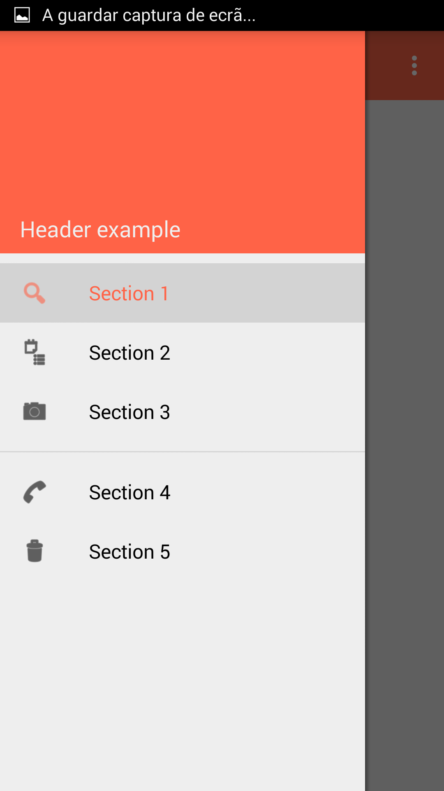

# NavigationViewExample
An example app with NavigationView of the android.support.design library

## Customize colors

To change text color and/or icon tint, set the color with these attributes in the NavigationView XML:

    app:itemIconTint="@color/navigation_item"
    app:itemTextColor="@color/navigation_item"

Where navigation_item is a selector:

    <selector xmlns:android="http://schemas.android.com/apk/res/android">
      <item android:state_checked="true" android:color="@color/Tomato"/>
      <item android:color="@android:color/primary_text_light"/>
    </selector>

Since the app:itemBackground attribute seems to have a bug
(I couldn't use a selector, all items were changing upon a click on a single one),
I created a theme:

    

And used it on the NavigationView:

    app:theme="@style/NavigationItemStyle"

## Screenshot

## TODO
- Find out how to change background color on focusable state.
- Create a mini navigation view as seen on: https://www.google.com/design/spec/patterns/navigation-drawer.html

## Dependencies

    compile 'com.android.support:appcompat-v7:22.2.0'
    compile 'com.android.support:design:22.2.0'

##License:
    Copyright © 2015 Rúben Sousa rubensousa.mieti@gmail.com 
    This work is free. You can redistribute it and/or modify it under the terms
    of the Do What The Fuck You Want To Public License, Version 2, as published by Sam Hocevar.
    See the LICENSE file for more details.
